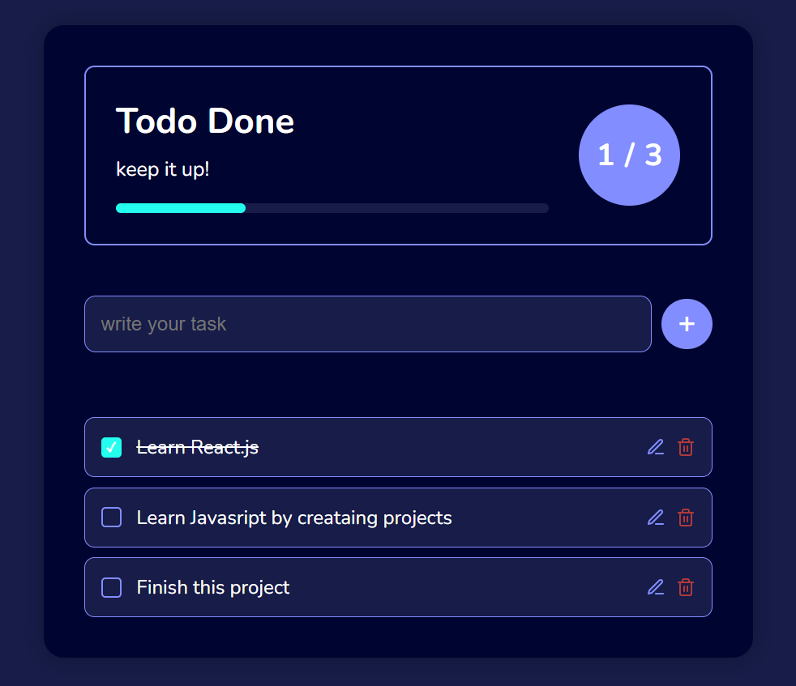

# Todo App

A React project focusing on state management with `useState` for dynamic and interactive UI.

### 🌐 Visit the website: [To-Do Live Demo](https://todo-list-mz.vercel.app/)

## 📸 Preview

## Key Concepts

- **State Management:** Leveraging `useState` for real-time task updates.  
- **Custom Hook:** A reusable custom hook for managing tasks in local storage.  
- **Components:** Modular structure with `Stats`, `TaskForm`, `TaskList`, and `TaskItem` components.  
- **Conditional Rendering:** Editing mode toggled dynamically for task updates.  
- **Event Handling:** User interactions for adding, editing, completing, and deleting tasks.  
- **Local Storage:** Persisting tasks for data retention across sessions using the custom hook.
